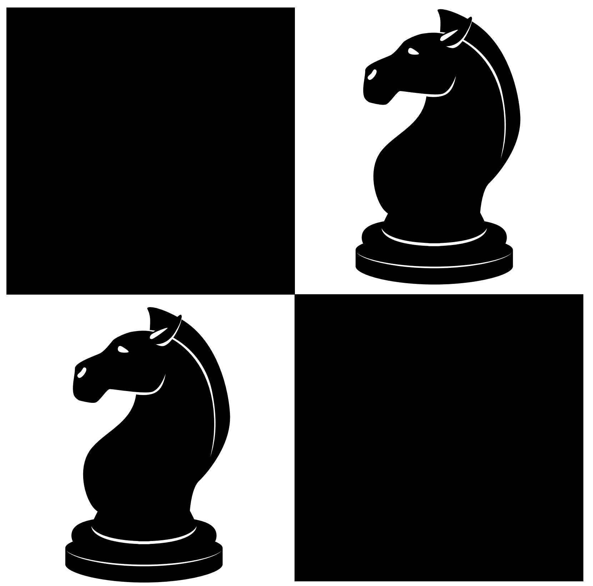

<p align="center">
  
  <h1 align="center">MaTEE</h1>
</p>

---

**This project efficiently defends against semantic gap vulnerabilities in TrustZone using ARM Pointer Authentication.**

- **If you are not familiar with semantic gap vulnerabilities, you can refer to [Boomerang](https://www.osti.gov/servlets/purl/1415101) and [Horizontal Privilege Escalation (HPE)](https://www.usenix.org/system/files/sec20-suciu.pdf).**
- **Qualcomm's [introduction](https://www.qualcomm.com/content/dam/qcomm-martech/dm-assets/documents/pointer-auth-v7.pdf) to the ARMv8.3 Pointer Authentication feature may help you better understand it.**

---
 
## 📦 1 Prerequisites
Install the dependencies in the [list](https://optee.readthedocs.io/en/latest/building/prerequisites.html). In addition, you need to install `python2`. Since we are using Ubuntu 22.04, it is recommended that you choose the same operating system.

## 👷‍♂️ 2 Setup
### 2.1 build
```shell
cd src/build
make PAUTH=y all -j `nproc`
```
### 2.2 run
```shell
make run-only
```
There will be two separate consoles, one for the non-secure world and another for the secure world.
<p align="center">
  
</p>

### 2.3 login
Enter `root` in the console of the non-secure world.

## 📝 3 Performance Evaluation
**It should be noted that the project runs on the FVP simulator, and the results may differ from testing on a real development board.**
### 3.1 TEE Client APIs.
```shell
optee_example_hello_world
```
### 3.2 xtest regressions
```shell
xtest
```
### 3.3 xtest benchmarks
```shell
xtest -t benchmark
```
### 3.4 Android Verified Boot (AVB)
```shell
avb
```
### 3.5 trusted keys
```shell
trusted_keys
```
### 3.6 DarkneTZ
```shell
cd /mnt/host/scripts/darknet
sh run_darknet.sh
```
## 🔒 4 Security Evaluation
- Recompile the project.
```shell
cd src/build
make PAUTH=y SECURE_EVALUATION=y all -j `nproc`
```
- Repeat steps 2.2 and 2.3.
- Execute the victim CA, and then launch the malicious CA.
```shell
semantic_victim &
semantic_attack
```
<p align="center">
  
</p>